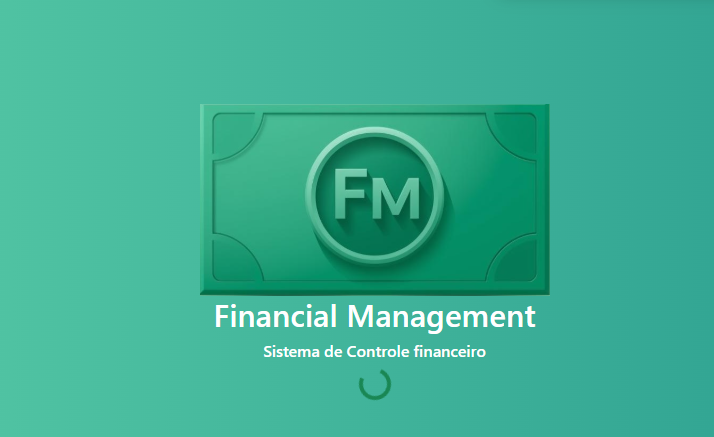
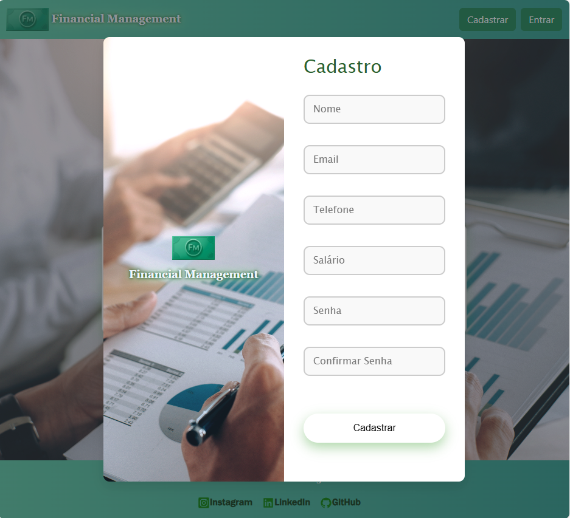
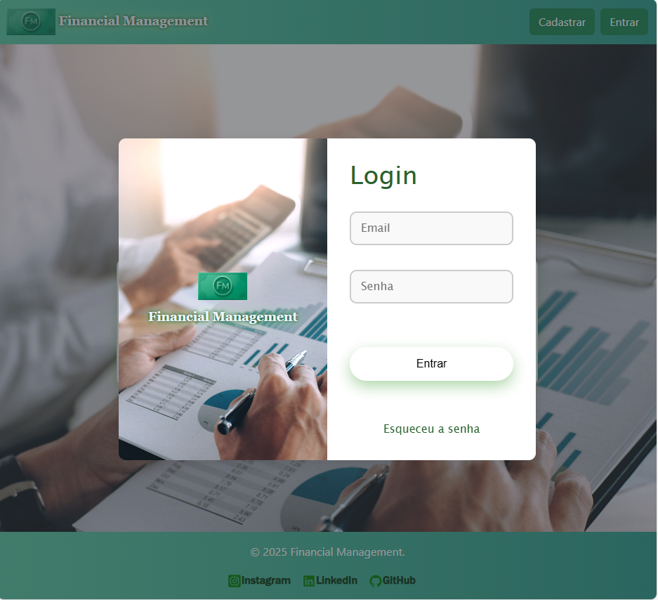
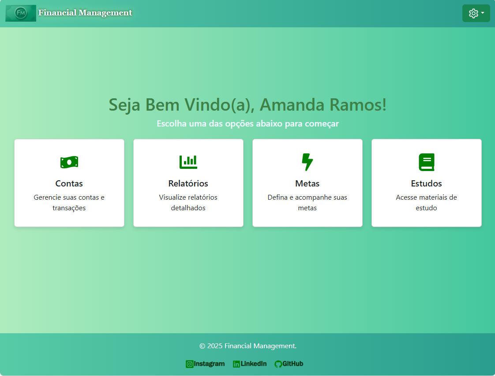
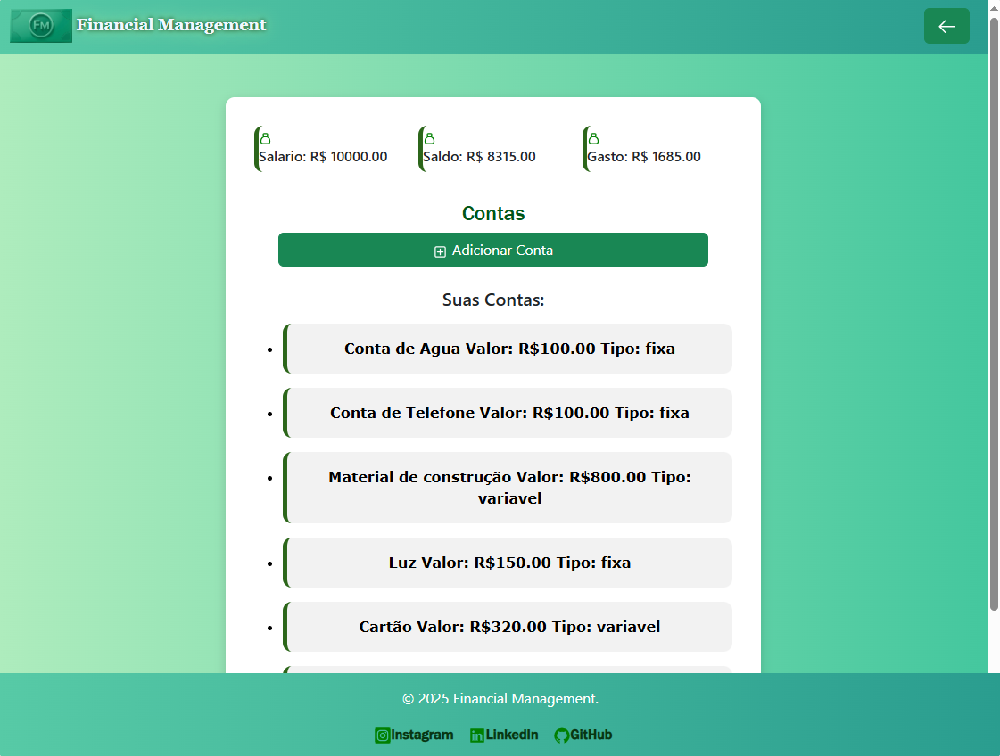
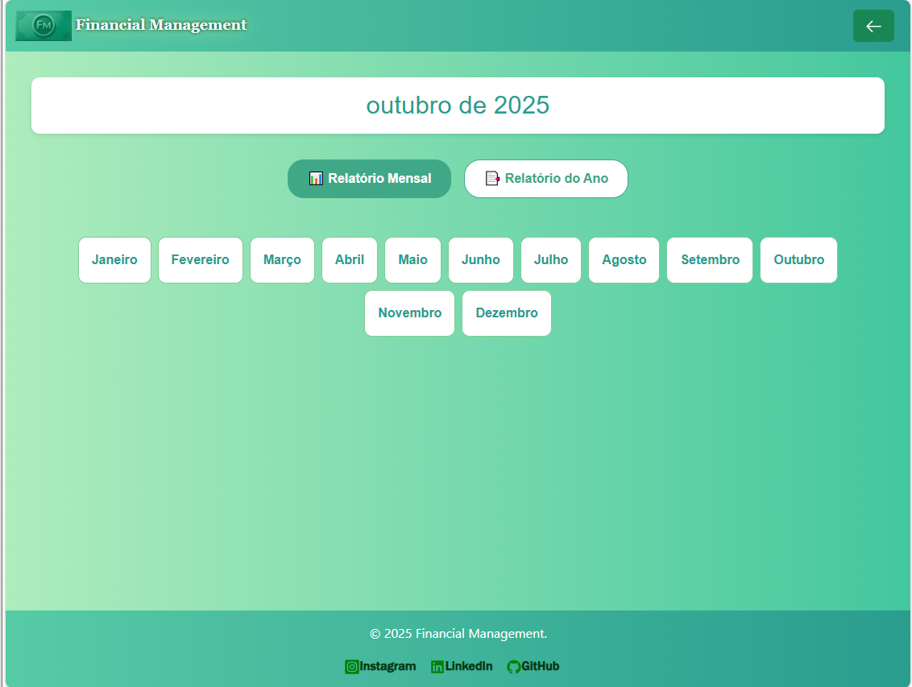
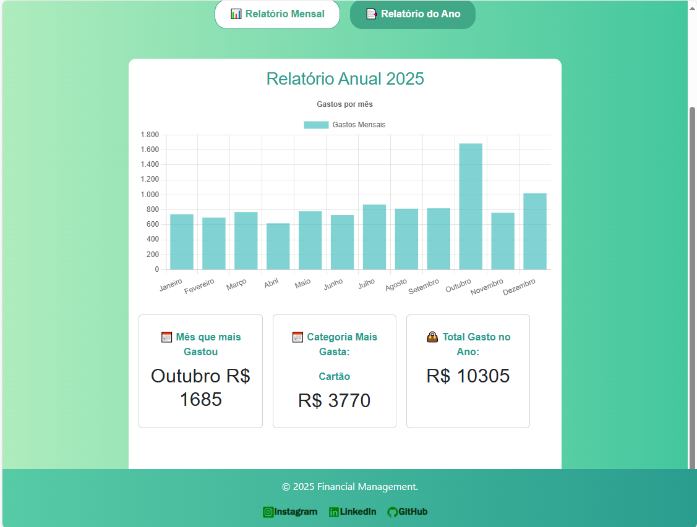
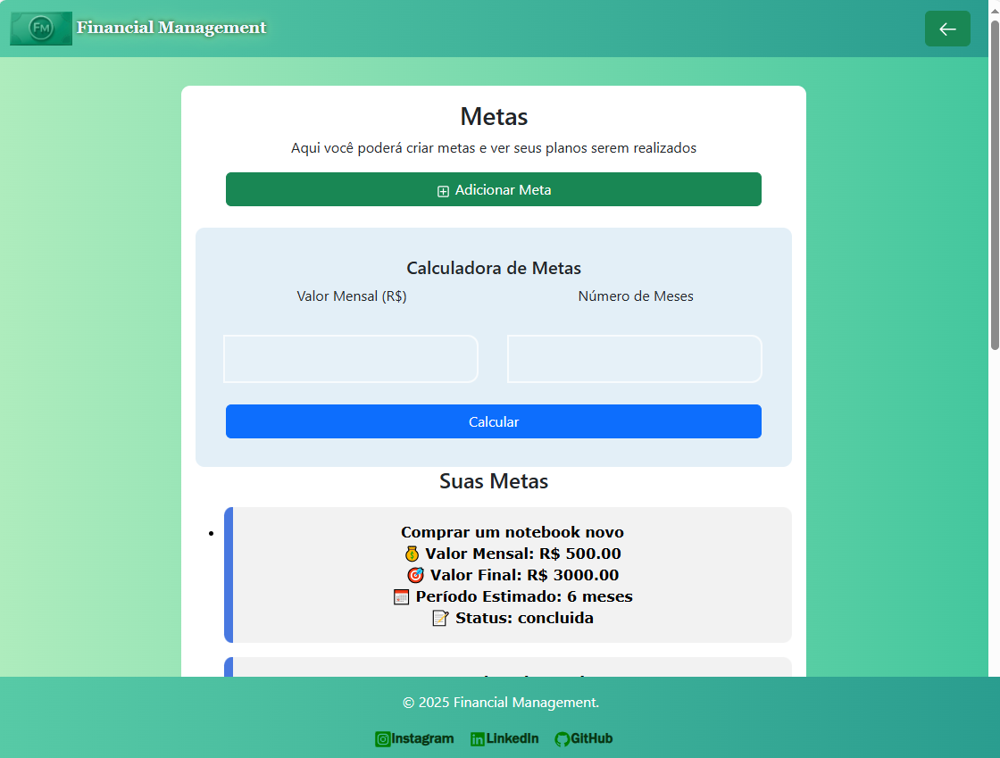
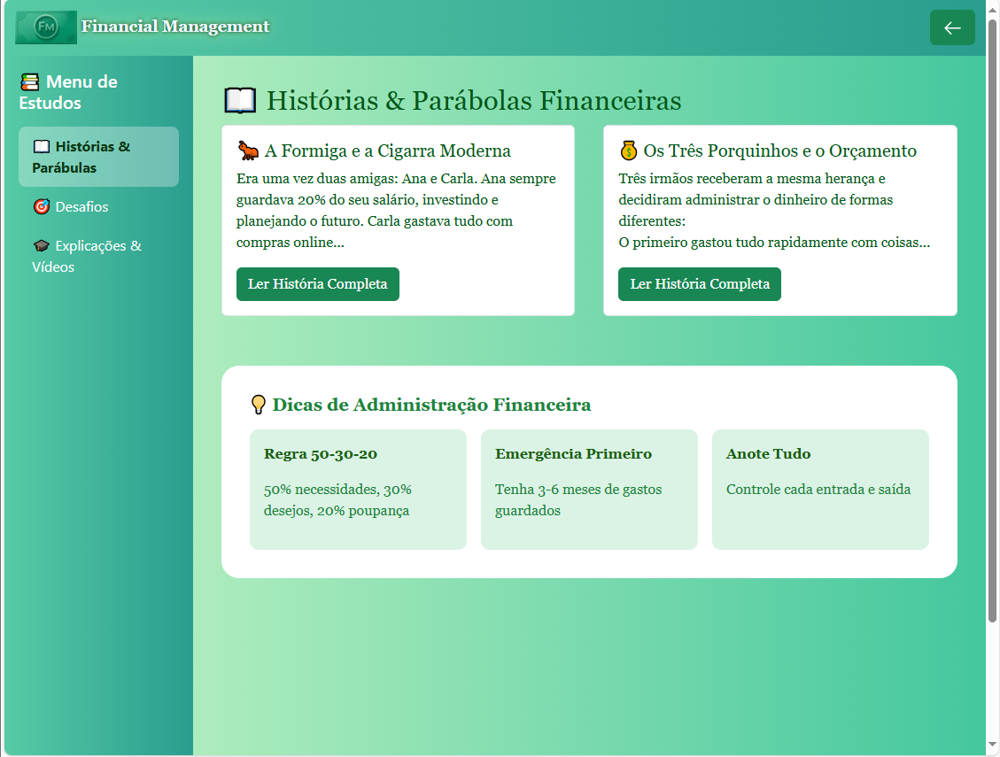

# Financial Management 💰
* Esse projeto foi desenvolvido com o objetivo de ajudar os usuários a controlar os seus gastos de forma simples.

## Sobre o Projeto
O Financial Management é um sistema web que permite ao usuário:
- Cadastrar suas contas e despesas;
- Acompanhar gastos em tempo real;
- Criar metas financeiras;
- Gerar relatórios mensais e anuais para melhor análise do orçamento.

## Tecnologias
- Frontend: HTML5​, CSS3​, Chart.js, ​JavaScript
- Frameworks e Bibliotecas: React.js, Bootstrap, Chart.js
- Backend: Flask (Python)
- Banco de Dados: MySQL
- Ferramentas de Apoio: GitHub, Canva
- Ambiente de Desenvolvimento: Visual Studio Code (VS Code)

**By: Amanda Ramos Oliveira**

## Telas do Site;

